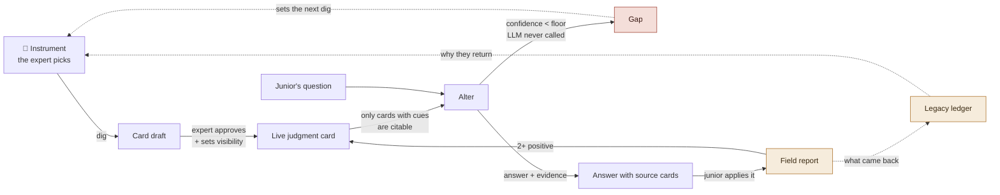

# yudonKnow

> **The senior leaves. The judgment stays.**

When an expert retires, what walks out is not documents — it is the eye that
reads a situation. yudonKnow hands them **instruments to dig that out
themselves**, freezes each call into a **judgment card**, and leaves behind an
**alter** that speaks only from those cards, so the people staying keep working
with it.

Built for the **All Things Agentic Hackathon** · category **Collaborative
Partner** · [한국어 README](README.ko.md)

---

## The gap this exists for

APQC surveyed 1,000 organizations (*Navigating the Great Retirement with KM &
AI*). Two of its numbers sit next to each other:

| | |
|---|---|
| **92%** | do not consistently capture knowledge from soon-to-be retirees |
| **58%** | of C-suite respondents are *very worried* about exactly that loss |
| **85%** | have not operationalised AI for knowledge management |
| **41%** | rarely or never even *attempt* to collect know-how from leavers |

They know. They still don't do it. That gap is the thesis: **it is not a
motivation problem, it is a tooling problem.** Yudon — a friend of the author,
a few years from retirement — already wants to leave his knowledge behind. Open
a blank document for him and he stops at "what do I even write."

---

## What it does



**The wheel turns on the arrows that come back**, not the ones going forward:
the **gap queue** decides where to dig next (topics are set by real demand, not
by a consultant), the **field report** is the only thing that earns a ✔ badge,
and the **legacy ledger** is why the expert comes back for session four.

### Six things that make it different

1. **A toolbox, not a text editor.** Twelve self-excavation instruments; the
   expert picks, the agent only recommends. The strongest is the *Wrong-Answer
   Grader* — the agent proposes a plausible but wrong judgment and the expert
   grabs a red pen. People cannot explain their own expertise, but they catch
   someone else's error in three seconds.
2. **Judgment cards, not documents.** One situation-call per card: situation,
   **cues**, judgment, action, rationale, **exceptions**, and the war story of
   when it went wrong. Cues and exceptions never make it into a procedure
   manual, and without them a junior cannot use the knowledge at all.
3. **What cannot be said is recorded as unsayable.** When "you just feel it"
   survives the sensory ladder, it goes in an `unspeakable` field, the card is
   flagged 🔴, and it is routed to in-person apprenticeship instead of being
   faked into prose. Coverage is capped at **0.95** so the system can never
   claim it got everything.
4. **The alter never impersonates.** The label on screen is always
   "*<name>*'s alter", the source card sits beside every answer, and it will
   not step outside the cards.
5. **"I don't know" is decided by code, not by the model.** Confidence is
   computed in plain Python from retrieval scores; below the floor the **LLM is
   never called at all**. Asking a model to "say you don't know if you don't
   know" is a design that fails.
6. **The gap goes back to the expert.** Unanswered questions queue on their home
   screen, ranked by how many juniors asked and how soon they leave.

---

## Architecture


Full walkthrough: **[`docs/architecture.md`](docs/architecture.md)**

The rule set on day one: **the model joins at the output layer only — text in,
text out.** The `BaseLLM` seam has exactly two methods, `answer` and `extract`.
No judgment is delegated to it: gap detection, citability gates, verification
badges and coverage are all decided by code and by people.

That rule was tested for real. Moving the base model from Anthropic to Gemini
changed **one file** — `app/capture/llm.py`. The elicitation ladder, the alter
and every scoring rule in `app/core/` were untouched and all 40 tests passed.
The Anthropic adapter is deliberately still in the tree: swappability is only
proven while the alternative still compiles.

```
app/core/      dependency-free  cards · retrieval + confidence · coverage · ledger
app/capture/   12 instruments · 5-rung ladder · LLM adapter (Gemini / Anthropic / stub)
app/alter/     the alter — card binding, evidence, gap decision
app/store/     SQLAlchemy schema + orchestration
app/web/       FastAPI + JSON API + 4 server-rendered screens
app/i18n.py    language negotiation (English default, Korean auto-detected)
```

`app/core/` imports no framework, no ORM and no SDK — `tests/test_isolation.py`
fails the build if anyone changes that.

---

## Hackathon requirements — where each one lives

| Requirement | Where |
|---|---|
| **Gemini 3.5+** via Gemini API or Vertex AI | `app/capture/llm.py::GeminiLLM` — Vertex by default in Cloud Run, no API key needed |
| **A Google agent framework** | **Google GenAI SDK** (`google-genai`), used for both generation and schema-forced extraction |
| **A Google Cloud infrastructure service** | **Cloud Run** (serving) + **Cloud SQL** (Postgres persistence) |

---

## Quick start (local)

```bash
git clone -b claude/expert-knowledge-preservation-tool-vtj127 \
  https://github.com/wilcoco/yudonKnow.git
cd yudonKnow

pip install -e ".[dev]"
YDK_SEED=1 uvicorn app.web.app:app --reload    # http://127.0.0.1:8000
pytest                                          # 40 tests
```

**It runs with no API key at all.** Without one the LLM falls back to a stub
that says it is a stub rather than inventing an answer — and the whole flow
(dig → card → alter → gap → field report → ledger) still turns. That is also a
live measurement of how little the design depends on any one model.

`YDK_SEED=1` plants a demo only when the database is empty:

- **`yudon`** — Korean, injection moulding. The real origin story.
- **`dale`** — English, a wastewater plant operator 31 days from retirement.

Then open:

| | |
|---|---|
| `/` | pick a role |
| `/expert` (enter `dale`) | legacy ledger · gap queue · mind map · toolbox |
| `/alter/dale` | ask *"the aeration foam went brown overnight"* — then ask *"how do I file my expense report"* and watch it refuse |
| `/admin` | succession risk board |

### Language

English is the default. A browser sending Korean first in `Accept-Language`
gets Korean automatically, and `?lang=en` / `?lang=ko` or the header toggle
overrides both. **Card *content* is never translated** — it is the expert's own
shop-floor vocabulary, and translating it turns knowledge into a summary.

---

## Deploy to Google Cloud

Step-by-step, copy-paste for Cloud Shell:
**[`docs/deploy-cloudrun.md`](docs/deploy-cloudrun.md)**

Short version — build, then deploy with Vertex access via the service account
(no API key is ever created):

```bash
gcloud builds submit --tag "$IMAGE" .
gcloud run deploy yudonknow \
  --image="$IMAGE" --region=us-central1 --allow-unauthenticated \
  --service-account="$SA_EMAIL" --add-cloudsql-instances="$CONN" \
  --set-secrets="DATABASE_URL=ydk-database-url:latest" \
  --set-env-vars="YDK_VERTEX_PROJECT=$PROJECT,YDK_LLM_PROVIDER=gemini,YDK_SEED=1"
```

Two failures look identical to a healthy deploy from the browser, so check both:

```bash
curl -s "$URL/api/health"          # "store" must be "postgresql", not "sqlite"
curl -s -X POST "$URL/api/alter/dale/ask" -H 'Content-Type: application/json' \
  -d '{"question":"the aeration foam went brown","asker":"judge"}' | grep stubbed
                                    # "stubbed": false — otherwise Gemini is not attached
```

### Configuration

| Variable | Default | Meaning |
|---|---|---|
| `YDK_LLM_PROVIDER` | `auto` | `auto` (Gemini → Anthropic → stub) · `gemini` · `anthropic` · `stub` |
| `YDK_VERTEX_PROJECT` | — | set it and Vertex is used with the runtime service account |
| `GOOGLE_API_KEY` | — | alternative to Vertex, for local development |
| `YDK_GEMINI_MODEL` | `gemini-3.5-pro` | **verify the exact id at deploy time** |
| `DATABASE_URL` | SQLite | `postgres://` is normalised to a psycopg URL automatically |
| `YDK_CONFIDENCE_FLOOR` | `0.35` | below this the alter refuses and files a gap — **without calling the LLM** |
| `YDK_ANCHOR_MIN_REPORTS` | `2` | positive field reports needed for a ✔ badge |
| `YDK_SEED` | — | `1` seeds the demo, only when the DB is empty |

Full list: [`.env.example`](.env.example)

---

## Design decisions the tests hold down

These are not comments. They are executing tests; reverting any of them turns
the suite red.

| Rule | Test |
|---|---|
| The gap decision never calls the LLM | `test_gap_decision_never_calls_the_llm` |
| A card with no cues is never citable, however complete | `test_card_without_cues_is_never_citable` |
| The alter never impersonates — in either language | `test_alter_label_never_impersonates` |
| A sealed card stays shut until the day the expert chose | `test_sealed_card_stays_shut_until_the_day_the_expert_chose` |
| Coverage never reaches 1.0 (ceiling 0.95) | `test_coverage_never_claims_completeness` |
| The toolbox opens with two instruments, not twelve | `test_toolbox_starts_with_only_two_instruments` |
| The ✔ badge comes only from field reports | `test_field_report_is_the_only_source_of_the_verified_badge` |
| An unrelated question is always a gap | `test_unrelated_english_question_is_always_a_gap` |
| **The wheel closes** — an approved card really is cited to a junior | `test_the_wheel_closes` |

---

## Deliberately not built

Not unfinished — decided against, in [`docs/design.md`](docs/design.md) §7.
A points economy (a retiring expert is not motivated by internal points), an
automated promotion gate (the verifier here is the field, not an algorithm),
and vector search as the primary retrieval path — see
[`docs/lineage.md`](docs/lineage.md) for why, and what it costs us.

## Standing on

Cognitive task analysis: **CDM** (Klein, Calderwood & MacGregor, 1989) and
**ACTA** (Militello & Hutton, 1998). The five-rung ladder is CDM's structure.
What kept CDM away from Yudon was never the method — it was that one interview
costs a trained knowledge engineer two to four hours plus several times that in
analysis. **An LLM removes that constraint. This is an economic change, not a
methodological one.** Where we step off the lineage, and what that costs, is
written down in [`docs/lineage.md`](docs/lineage.md).

## Reading order

| | |
|---|---|
| [`docs/design.md`](docs/design.md) | design canon — concepts, the wheel, state machine, open problems |
| [`docs/self-excavation.md`](docs/self-excavation.md) | the 12 instruments + control rights |
| [`docs/lineage.md`](docs/lineage.md) | CTA lineage, prior art, where we differ |
| [`docs/user-flows.md`](docs/user-flows.md) | expert / junior / admin flows + 4-week rollout |
| [`docs/elicitation-protocol.md`](docs/elicitation-protocol.md) | the 5-rung ladder |
| [`docs/architecture.md`](docs/architecture.md) | architecture walkthrough |
| [`docs/reuse-map.md`](docs/reuse-map.md) | what was reused from prior repos — **and what was not** |
| [`docs/deploy-cloudrun.md`](docs/deploy-cloudrun.md) | deployment |

## Pre-existing work disclosure

This project was created during the Submission Period (first commit
2026-08-27). Reused components — configuration skeleton and the stub-fallback
convention from [alter-ai](https://github.com/wilcoco/alter-ai), the
external-reality anchor and dormant/revive state machine from
[CAMS-KnowledgeNet](https://github.com/wilcoco/CAMS-KnowledgeNet), and the
P→I→C graph vocabulary from [H2A2H2](https://github.com/wilcoco/H2A2H2) — are
all authored by the same author and itemised in
[`docs/reuse-map.md`](docs/reuse-map.md). Everything else was built during the
Submission Period.

## Open problems

Not solved, and not claimed to be: the tacit-knowledge bottleneck (🔴
fingertip knowledge does not come out through any of the twelve instruments —
this tool *marks* it rather than solving it), the expert's own self-report
bias, authority lock-in as the alter accumulates verified cards, finding time
to dig (an adoption condition, not a product feature), and what happens when
two experts' alters disagree. [`docs/design.md`](docs/design.md) §8.
