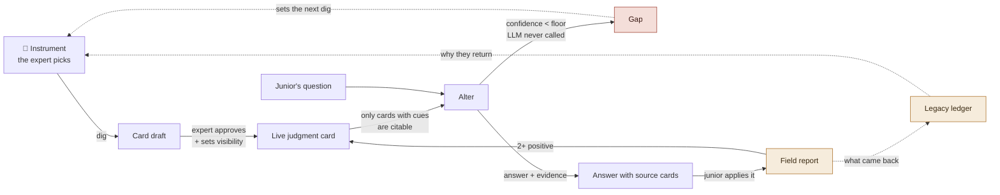
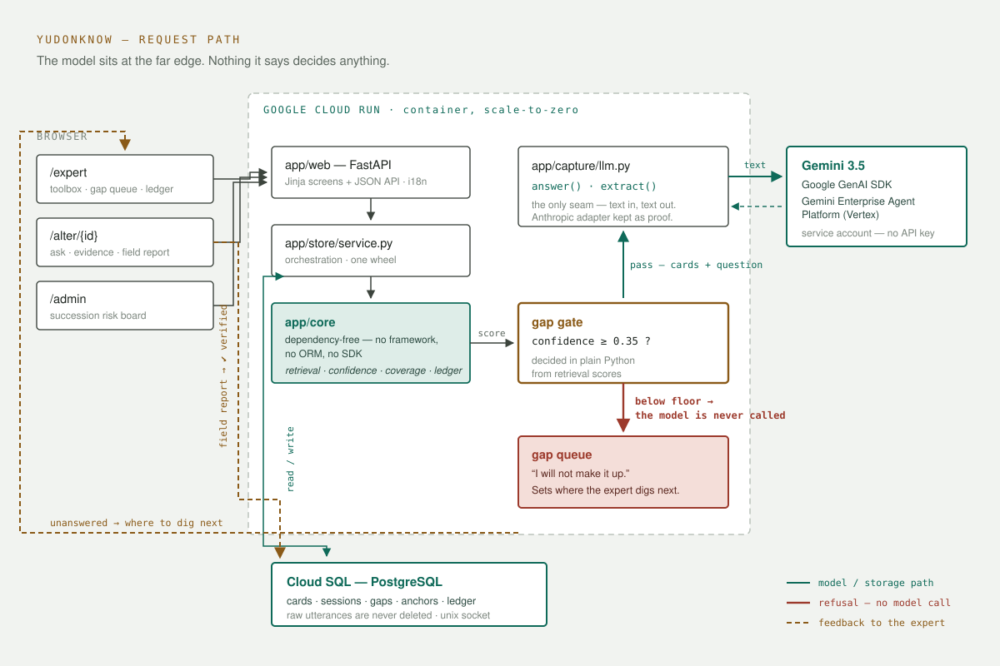

# yudonKnow

> **Most AI answers your questions. This one asks you.**
>
> **The senior leaves. The judgment stays.**

Ask a retiring expert how he knows a molding defect is a speed problem and not
a temperature problem and he says *"you just see it."* He is not withholding.
**He genuinely does not know what he knows until someone asks him the right
question** — which is why a blank handover document, a wiki, and a RAG chatbot
over company files all fail in the same place.

So the interview is the product. yudonKnow is an agent that **interviews** the
expert — the way a human knowledge engineer would, using probes taken from the
cognitive-task-analysis literature — freezes each call into a **judgment card**,
and leaves behind an **alter** that speaks only from those cards, so the people
staying keep working with it.

The inversion is the whole design: **the human is the source, the agent is the
interviewer.** Everything downstream — what a card contains, what the alter may
say, when it must refuse — follows from taking that seriously.

Built for the **All Things Agentic Hackathon** · category **Collaborative
Partner** · [한국어 README](README.ko.md)

**Live** (Cloud Run): <https://yudonknow-530548975242.us-central1.run.app> ·
119 automated tests · Gemini 3.5 Flash via the Google GenAI SDK on Vertex AI

---

## The gap this exists for

APQC surveyed 1,000 organizations (*Navigating the Great Retirement with KM &
AI*). Two of its numbers sit next to each other:

| | |
|---|---|
| **92%** | do not consistently capture knowledge from soon-to-be retirees |
| **58%** | of C-suite respondents are *very worried* about exactly that loss |
| **85%** | have not operationalised AI for knowledge management |
| **41%** | rarely or never even *attempt* to collect know-how from leavers |

They know. They still don't do it. That gap is the thesis: **it is not a
motivation problem, it is a tooling problem.** Yudon — a friend of the author,
a few years from retirement — already wants to leave his knowledge behind. Open
a blank document for him and he stops at "what do I even write."

The author also runs a manufacturing company and was mid-way through hands-on
automation projects when Yudon asked — which is exactly where the limit of
automation becomes visible: **automation takes the procedures; the judgment
walks out the door.** The injection, painting, and assembly lines this tool is
being built for are run by people with forty-plus years in their hands. The aim
is double: a knowledge system while they are here, and a memoir — compiled from
their own dug-out judgment, never written on demand — when they leave
(`/memoir/{expert}`).

---

## What it does



**The wheel turns on the arrows that come back**, not the ones going forward:
the **gap queue** decides where to dig next (topics are set by real demand, not
by a consultant), the **field report** is the only thing that earns a ✔ badge,
and the **legacy ledger** is why the expert comes back for session four.
Sentiment starts the wheel; it does not sustain it — so the same ledger doubles
as an **audit-grade settlement basis**: because it refuses vanity metrics
(citations and explicit field reports only, "did not hold" included), the expert
can pull a usage statement and bill the company under a knowledge-royalty
policy. Pride first, fee second, same numbers.

### Seven things that make it different

1. **The agent interviews; the expert never picks a method.** The expert types
   one thing that happened. From there the agent asks, reflects back what it
   understood (*"so — cues: … have I got that right?"*), and follows the answer.
   Twelve instruments sit behind that, but the expert is never handed a menu.
   The strongest is the *Wrong-Answer Grader* — the agent proposes a plausible
   but wrong judgment and the expert grabs a red pen. People cannot explain
   their own expertise, but they catch someone else's error in three seconds.
2. **Judgment cards, not documents.** One situation-call per card: situation,
   **cues**, judgment, action, rationale, **exceptions**, and the war story of
   when it went wrong. Cues and exceptions never make it into a procedure
   manual, and without them a junior cannot use the knowledge at all.
3. **What cannot be said is recorded as unsayable.** When "you just feel it"
   survives the sensory ladder, it goes in an `unspeakable` field, the card is
   flagged 🔴, and it is routed to in-person apprenticeship instead of being
   faked into prose. Coverage is capped at **0.95** so the system can never
   claim it got everything.
4. **The alter never impersonates.** The label on screen is always
   "*<name>*'s alter", the source card sits beside every answer, and it will
   not step outside the cards.
5. **"I don't know" is decided by code, not by the model.** Confidence is
   computed in plain Python from retrieval scores; below the floor the **LLM is
   never called at all**. Asking a model to "say you don't know if you don't
   know" is a design that fails.
6. **Approved rules run deterministically — the compiler's execution layer.**
   On the approval screen the AI pre-drafts decision rules from the card
   (all-of / none-of / priority, tagged with canonical signal IDs so the same
   sign is asked exactly once) and **nothing runs until the expert saves**.
   Juniors then walk a structured triage (`/protocol/{expert}`): yes/no/unknown
   per sign, evaluated by a pure-Python engine — one urgent sign escalates, a
   reassuring verdict needs its whole gate, unknowns never downgrade, and on
   conflict the urgent judgment executes while the milder one is explicitly
   held. The LLM discovers protocols; it never executes them.
7. **The gap goes back to the expert.** Unanswered questions queue on their home
   screen, ranked by how many juniors asked and how soon they leave.

---

### The questions are not improvised

The interview follows published elicitation research rather than prompt taste
([`docs/elicitation-protocol.md`](docs/elicitation-protocol.md)):

- **Entry — ACTA Knowledge Audit** (Militello & Hutton, 1998). Eight probes,
  each calling for a *different kind* of story: anomalies, equipment
  difficulties, noticing, past & future, job smarts, self-monitoring, big
  picture, improvising. The Critical Decision Method's classic opener — "your
  hardest incident" — is excellent for depth but too narrow as a door: the
  knowledge people use quietly every day is never recalled as *hard*. The entry
  probe rotates, because one question only ever returns one kind of knowledge.
- **Depth — Critical Decision Method** (Klein et al., 1989; Hoffman et al.,
  1998). Progressive deepening: cues → strategies → what a less experienced
  person would have done wrong → boundaries → failures.
- **A limit we designed around.** Nisbett & Wilson (1977) showed people have no
  introspective access to their own decision processes; Ericsson & Simon (1984)
  concluded that after-the-fact *explanation* is not usable data. So `cues`
  ("what did you see") is treated as observation and is the hard gate for
  citation, while `rationale` ("why does it work") is treated as the most
  confabulation-prone field and never blocks a card. The gate is not a hunch —
  it is where the literature says the reliable signal is.

This tool is still recall-based, so it does not meet the Ericsson & Simon bar
for concurrent verbalisation. Recall bias is **reduced, not solved**, and the
protocol says so.

---

## Architecture



Full walkthrough: **[`docs/architecture.md`](docs/architecture.md)**

The rule set on day one: **the model joins at the output layer only — text in,
text out.** The `BaseLLM` seam has exactly two methods, `answer` and `extract`.
No judgment is delegated to it: gap detection, citability gates, verification
badges and coverage are all decided by code and by people.

That rule was tested for real. Moving the base model from Anthropic to Gemini
changed **one file** — `app/capture/llm.py`. The elicitation ladder, the alter
and every scoring rule in `app/core/` were untouched and every test passed.
The Anthropic adapter is deliberately still in the tree: swappability is only
proven while the alternative still compiles.

```
app/core/      dependency-free  cards · retrieval + confidence · coverage · ledger
app/capture/   12 instruments · 5-rung ladder · LLM adapter (Gemini / Anthropic / stub)
app/alter/     the alter — card binding, evidence, gap decision
app/store/     SQLAlchemy schema + orchestration
app/web/       FastAPI + JSON API + 4 server-rendered screens
app/i18n.py    language negotiation (English default, Korean auto-detected)
```

`app/core/` imports no framework, no ORM and no SDK — `tests/test_isolation.py`
fails the build if anyone changes that.

---

## Hackathon requirements — where each one lives

| Requirement | Where |
|---|---|
| **Gemini 3.5+** via Gemini API or Vertex AI | `app/capture/llm.py::GeminiLLM` — Vertex by default in Cloud Run, no API key needed |
| **A Google agent framework** | **Google GenAI SDK** (`google-genai`), used for both generation and schema-forced extraction |
| **A Google Cloud infrastructure service** | **Cloud Run** (serving) + **Cloud SQL** (Postgres) + Secret Manager + Cloud Build/Artifact Registry |

---

## Two ways to try it (for judges)

**Track A — zero effort, as the junior (2 min).** Open the live app and ask
**Dale's alter** about brown foam, weir stringing, or a rising pH. Watch it
answer in his voice with the source card beside it — then ask about UV bank
calibration and watch it *refuse* ("this is not an area Dale left behind").
Try **📋 Step-by-step protocol** on the alter page: answer yes/no/unknown and
watch the deterministic engine escalate on one urgent sign, hold a reassuring
verdict until its whole gate is confirmed, and resolve conflicts by priority.
Then open Dale's expert page: a shelf of judgment cards in every state
(✔ field-verified, ⚠ contested with the junior's actual report, ⏳ half-dug),
and a document shelf where his SOP is organized **by what it does not say** —
"5 judgment points · 2 filled".

**Track B — three minutes, as yourself.** You have tacit knowledge too — about
code review, hiring, debugging, anything. Create your own expert, type one
thing that happened, and answer the questions the agent asks. Three minutes
later you will see your own judgment as a card, and your own alter answering
with it in your own turns of phrase. That moment — *"it stays"* — is the
product.

The interview works on any domain because the probes come from the
cognitive-task-analysis literature, not from a domain template.

---

## Quick start & reproducible testing (local)

```bash
git clone https://github.com/wilcoco/yudonKnow.git
cd yudonKnow

pip install -e ".[dev]"
pytest                                          # 119 tests, all offline (stub LLM)
YDK_SEED=1 uvicorn app.web.app:app --reload     # http://127.0.0.1:8000
```

The test suite needs **no API key, no network, and no database server** — it
runs on a temp SQLite with the stub LLM, so `pytest` reproduces every design
guarantee below on any machine. To exercise the live-model path instead, set
`GOOGLE_CLOUD_PROJECT` (Vertex AI) or `GOOGLE_API_KEY` and rerun.

**It runs with no API key at all.** Without one the LLM falls back to a stub
that says it is a stub rather than inventing an answer — and the whole flow
(dig → card → alter → gap → field report → ledger) still turns. That is also a
live measurement of how little the design depends on any one model.

`YDK_SEED=1` plants a demo only when the database is empty:

- **`yudon`** — Korean, injection moulding. The real origin story.
- **`dale`** — English, a wastewater plant operator 31 days from retirement.

Then open:

| | |
|---|---|
| `/` | pick a role |
| `/expert` (enter `dale`) | legacy ledger · gap queue · mind map · toolbox |
| `/alter/dale` | ask *"the aeration foam went brown overnight"* — then ask *"how do I file my expense report"* and watch it refuse |
| `/admin` | succession risk board |

### Language

English is the default. A browser sending Korean first in `Accept-Language`
gets Korean automatically, and `?lang=en` / `?lang=ko` or the header toggle
overrides both. **Card *content* is never translated** — it is the expert's own
shop-floor vocabulary, and translating it turns knowledge into a summary.

---

## Deploy to Google Cloud

Step-by-step, copy-paste for Cloud Shell:
**[`docs/deploy-cloudrun.md`](docs/deploy-cloudrun.md)**

Short version — build, then deploy with Vertex access via the service account
(no API key is ever created):

```bash
gcloud builds submit --tag "$IMAGE" .
gcloud run deploy yudonknow \
  --image="$IMAGE" --region=us-central1 --allow-unauthenticated \
  --service-account="$SA_EMAIL" --add-cloudsql-instances="$CONN" \
  --set-secrets="DATABASE_URL=ydk-database-url:latest" \
  --set-env-vars="YDK_VERTEX_PROJECT=$PROJECT,YDK_LLM_PROVIDER=gemini,YDK_SEED=1"
```

Two failures look identical to a healthy deploy from the browser, so check both:

```bash
curl -s "$URL/api/health"          # "store" must be "postgresql", not "sqlite"
curl -s -X POST "$URL/api/alter/dale/ask" -H 'Content-Type: application/json' \
  -d '{"question":"the aeration foam went brown","asker":"judge"}' | grep stubbed
                                    # "stubbed": false — otherwise Gemini is not attached
```

### Configuration

| Variable | Default | Meaning |
|---|---|---|
| `YDK_LLM_PROVIDER` | `auto` | `auto` (Gemini → Anthropic → stub) · `gemini` · `anthropic` · `stub` |
| `YDK_VERTEX_PROJECT` | — | set it and Vertex is used with the runtime service account |
| `GOOGLE_API_KEY` | — | alternative to Vertex, for local development |
| `YDK_GEMINI_MODEL` | `gemini-3.5-pro` | **verify the exact id at deploy time** |
| `DATABASE_URL` | SQLite | `postgres://` is normalised to a psycopg URL automatically |
| `YDK_CONFIDENCE_FLOOR` | `0.35` | below this the alter refuses and files a gap — **without calling the LLM** |
| `YDK_ANCHOR_MIN_REPORTS` | `2` | positive field reports needed for a ✔ badge |
| `YDK_SEED` | — | `1` seeds the demo, only when the DB is empty |

Full list: [`.env.example`](.env.example)

---

### Interviewer quality is evaluated, not assumed

`python evals/interviewer_evals.py` replays four uncooperative-expert personas
(rambling, generality-escape, ranting, curt) against the live base and checks
**structural interviewing moves** — one incident at a time, pull generality
down to a day, return from rants, retry without shaming — plus that English
speech extracts to English cards. Swapping the base model is only a brag if
you can prove quality survived the swap; this file is that proof.

## Design decisions the tests hold down

These are not comments. They are executing tests; reverting any of them turns
the suite red.

| Rule | Test |
|---|---|
| The gap decision never calls the LLM | `test_gap_decision_never_calls_the_llm` |
| A card with no cues is never citable, however complete | `test_card_without_cues_is_never_citable` |
| The alter never impersonates — in either language | `test_alter_label_never_impersonates` |
| A sealed card stays shut until the day the expert chose | `test_sealed_card_stays_shut_until_the_day_the_expert_chose` |
| Coverage never reaches 1.0 (ceiling 0.95) | `test_coverage_never_claims_completeness` |
| The toolbox opens with two instruments, not twelve | `test_toolbox_starts_with_only_two_instruments` |
| The ✔ badge comes only from field reports | `test_field_report_is_the_only_source_of_the_verified_badge` |
| An unrelated question is always a gap | `test_unrelated_english_question_is_always_a_gap` |
| **The wheel closes** — an approved card really is cited to a junior | `test_the_wheel_closes` |

---

## Deliberately not built

Not unfinished — decided against, in [`docs/design.md`](docs/design.md) §7.
A points economy (a retiring expert is not motivated by internal points), an
automated promotion gate (the verifier here is the field, not an algorithm),
and vector search as the primary retrieval path — see
[`docs/lineage.md`](docs/lineage.md) for why, and what it costs us.

**Authentication is deliberately deferred, not missing.** This product has
two roles, and the demo's whole point is that one judge, alone, can walk the
full wheel in three minutes — ask as a junior, receive the question as the
senior, answer it into a card, then watch the alter cite it back. An account
system would cut that wheel in half. The identity switcher keeps it whole,
on synthetic data that authentication would have nothing to protect. The production design is already fixed
(`docs/roadmap.md`): corporate SSO — for a Microsoft 365 org, Entra ID OIDC
with the immutable `oid` claim as the actor id. Permission checks are already
centralised in two functions (`viewer == expert`, `visible_to()`), so the
swap is a days-scale integration, not a redesign — and it upgrades the
compensation ledger to authenticated identities for free.

## Standing on

Cognitive task analysis: **CDM** (Klein, Calderwood & MacGregor, 1989) and
**ACTA** (Militello & Hutton, 1998). The five-rung ladder is CDM's structure.
What kept CDM away from Yudon was never the method — it was that one interview
costs a trained knowledge engineer two to four hours plus several times that in
analysis. **An LLM removes that constraint. This is an economic change, not a
methodological one.** Where we step off the lineage, and what that costs, is
written down in [`docs/lineage.md`](docs/lineage.md).

## Reading order

| | |
|---|---|
| [`docs/design.md`](docs/design.md) | design canon — concepts, the wheel, state machine, open problems |
| [`docs/self-excavation.md`](docs/self-excavation.md) | the 12 instruments + control rights |
| [`docs/lineage.md`](docs/lineage.md) | CTA lineage, prior art, where we differ |
| [`docs/user-flows.md`](docs/user-flows.md) | expert / junior / admin flows + 4-week rollout |
| [`docs/elicitation-protocol.md`](docs/elicitation-protocol.md) | the 5-rung ladder |
| [`docs/architecture.md`](docs/architecture.md) | architecture walkthrough |
| [`docs/reuse-map.md`](docs/reuse-map.md) | what was reused from prior repos — **and what was not** |
| [`docs/deploy-cloudrun.md`](docs/deploy-cloudrun.md) | deployment |

## Pre-existing work disclosure

This project was created during the Submission Period (first commit
2026-08-27). Reused components — configuration skeleton and the stub-fallback
convention from [alter-ai](https://github.com/wilcoco/alter-ai), the
external-reality anchor and dormant/revive state machine from
[CAMS-KnowledgeNet](https://github.com/wilcoco/CAMS-KnowledgeNet), and the
P→I→C graph vocabulary from [H2A2H2](https://github.com/wilcoco/H2A2H2) — are
all authored by the same author and itemised in
[`docs/reuse-map.md`](docs/reuse-map.md). Everything else was built during the
Submission Period.

## Open problems

Not solved, and not claimed to be: the tacit-knowledge bottleneck (🔴
fingertip knowledge does not come out through any of the twelve instruments —
this tool *marks* it rather than solving it), the expert's own self-report
bias, authority lock-in as the alter accumulates verified cards, finding time
to dig (an adoption condition, not a product feature), and what happens when
two experts' alters disagree. [`docs/design.md`](docs/design.md) §8.
